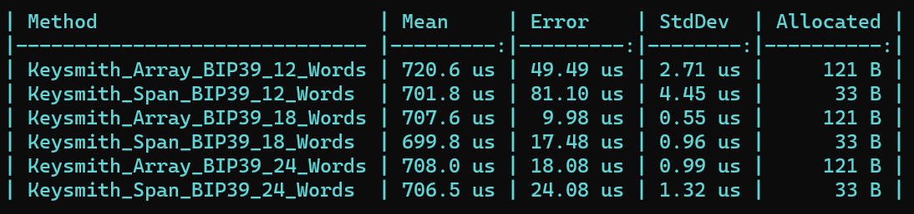

# Keysmith.Net

Modern .NET9 library implementing common cryptographic standards used by various cryptocurrencies like BIP32, BIP39 and BIP44.

The intention of this library is to provide minimal no boilerplate implemenations of these cryptographic primitives while maintaining the best possible performance using the latest language features.

## Features
### BIP39
Converts mnemonic words to the seed used for deriving private keys.
> [!NOTE]  
> Only supports the english wordlist.

#### Usage
```cs
byte[] seed = BIP39.MnemonicToSeed("[mnemonics]");
//Or using spans
Span<byte> seed = stackalloc byte[256];
BIP39.TryMnemonicToSeed(seed, "[mnemonics]")
```

#### Performance



### BIP32
Takes the seed calculated using BIP39 and derives the master private key and child keys using BIP44 derivation paths.

> [!NOTE]  
> Currently only supports Secp256k1.

#### Usage
```cs
(byte[] key, byte[] chainCode) = BIP32.DerivePath(
    ECCurves.Secp256k1,
    TestData.Seed_6_Words,
    "m/44'/60'/0'/0/0"
);
//Or using spans
Span<byte> key = stackalloc byte[32];
Span<byte> chainCode = stackalloc byte[32];
Span<uint> path = stackalloc uint[5];
BIP44.Ethereum(path);
BIP32.TryDerivePath(
    ECCurves.Secp256k1,
    seed,
    key,
    chainCode,
    path
);
```

#### Performance


### BIP44

Defines the format for derivation paths used for Bitcoin and a lot of other chains following the same spec.

This library defines helper methods to construct these paths to be used for BIP32 derivation.

#### Usage

```cs
string path = BIP44.Ethereum(5);
//     ^ "m/44'/60'/0'/0/5"
// Or using spans
Span<uint> path = stackalloc uint[5];
BIP44.Ethereum(path, 5);
```
